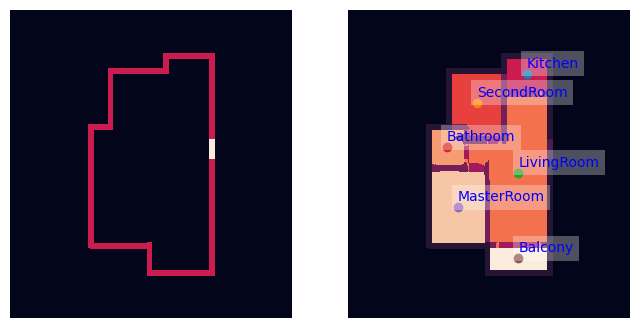
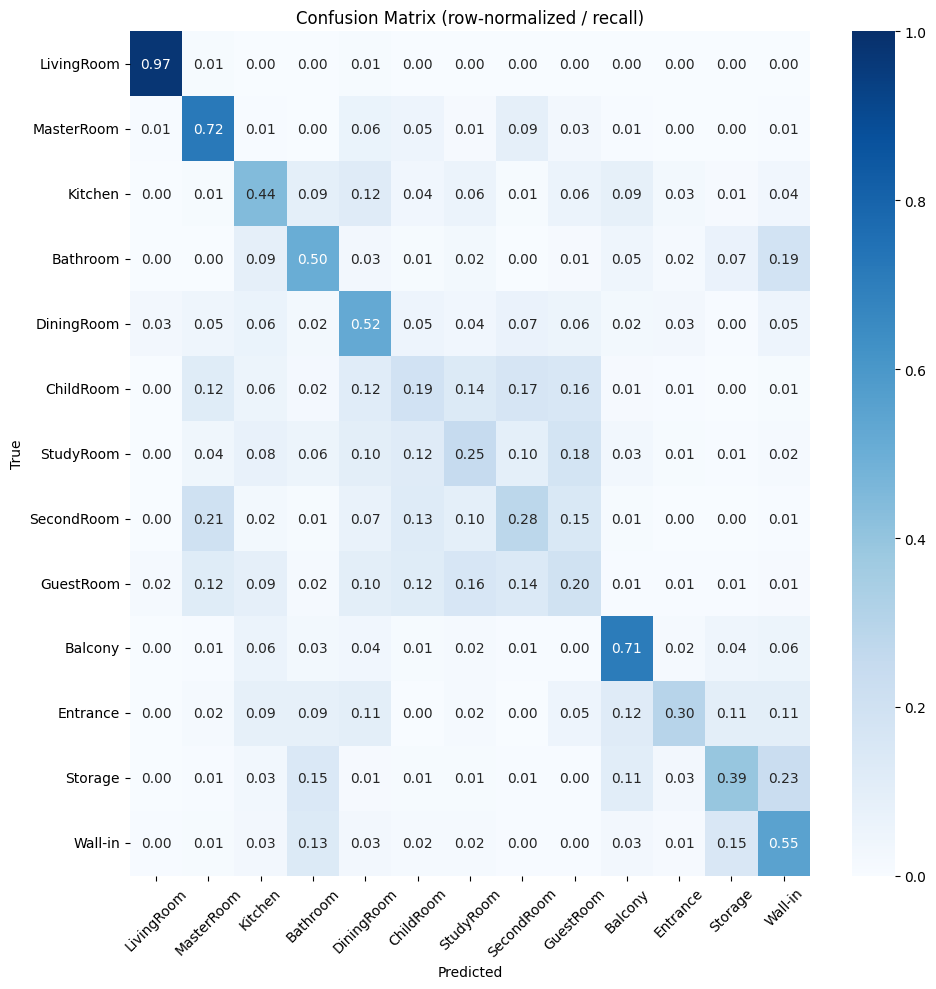
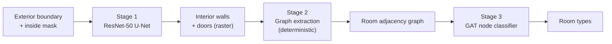

# Generative Interior Synthesis
Game studios reuse building interiors because handcrafting them doesn't scale. This work explores a generative process for creating background interiors to increase environmental variety without proportional cost.

A two-stage pipeline that generates an interior floor plan from a building's exterior outline. A U-Net with a ResNet-50 encoder draws the interior walls and doors, a deterministic algorithm turns that drawing into a room adjacency graph, and a graph attention network (GAT) labels each room by type.

> **Scope.** Generated layouts are not architecturally or structurally
> validated and are not suitable for real construction. The goal is plausible
> background interiors for virtual environments, not buildable plans.



*One validation example. Left: the input exterior boundary. Right: the rooms found in the predicted layout, each labelled by the GAT.*

---

## Results

Evaluated on the validation split (16,158 of 80,788 plans).

| Metric | Value | Source |
|---|---|---|
| GAT node classification accuracy | **59.35%** | SageMaker training logs |
| Majority-class baseline (always "SecondRoom") | 18.23% | Class counts in `3_EDA` (99,987 of 548,438 rooms) |
| Generated plans that produced a usable graph | **74.54%** (3,727 of 5,000) | `5_Testing` |
| U-Net validation loss (BCE + Dice, summed over both output heads) | 1.2078 after 15 epochs | SageMaker training logs |
| GAT validation loss (class-weighted cross-entropy) | 1.5954 after 48 epochs | SageMaker training logs |

- **Accuracy is modest.** It beats the baseline by 41.12 percentage points, but 40.65% of rooms are still mislabelled. The 59.35% was measured on graphs built from real floor plans. Generated plans have no ground-truth room types, so their labelling accuracy can't be measured directly.
- **"Usable graph"** means that, after thresholding the U-Net output, the extracted graph could be passed through the GAT without error. It says nothing about whether the layout is sensible.

### Per-class GAT performance



*GAT predictions on graphs built from real validation floor plans (109,603 rooms). Each row is a true room type and sums to 1, so the diagonal is recall. Produced by `New_Metrics.ipynb`.*

| Room type | Precision | Recall | F1 | Rooms |
|---|---|---|---|---|
| LivingRoom | 0.99 | 0.97 | 0.98 | 16,158 |
| MasterRoom | 0.71 | 0.72 | 0.71 | 16,097 |
| Kitchen | 0.65 | 0.44 | 0.52 | 15,560 |
| Bathroom | 0.79 | 0.50 | 0.62 | 19,348 |
| DiningRoom | 0.02 | 0.52 | 0.04 | 253 |
| ChildRoom | 0.03 | 0.19 | 0.05 | 791 |
| StudyRoom | 0.15 | 0.25 | 0.19 | 2,923 |
| SecondRoom | 0.71 | 0.28 | 0.41 | 20,008 |
| GuestRoom | 0.01 | 0.20 | 0.01 | 162 |
| Balcony | 0.81 | 0.71 | 0.76 | 17,324 |
| Entrance | 0.01 | 0.30 | 0.03 | 57 |
| Storage | 0.10 | 0.39 | 0.16 | 689 |
| Wall-in | 0.02 | 0.55 | 0.04 | 233 |
| **Macro average** | 0.39 | 0.46 | 0.35 | |

- **Living rooms are solved; bedrooms are not.** LivingRoom reaches 0.97 recall, and MasterRoom and Balcony are above 0.70. The five bedroom types (Master, Child, Study, Second, Guest) are mostly confused with each other. SecondRoom, the most common room type, has only 0.28 recall: 21% of second rooms are called MasterRoom. Position, area and adjacency alone don't separate rooms that look alike.
- **Small service rooms blur together.** 19% of bathrooms are predicted as Wall-in, and storage rooms go to Wall-in (23%) or Bathroom (15%).
- **Rare classes are over-predicted.** The class weighting pushes recall on rare types up to 0.20–0.55, but their precision is 0.01–0.15. Almost every DiningRoom, GuestRoom, Entrance or Wall-in prediction is wrong. This matches the inflated Entrance rate in generated plans (see Limitations).

---

## How it works



**Learned Stage 1: Wall and door prediction (CNN).** A U-Net takes two 256×256 masks: the building's exterior walls and its interior footprint. Its encoder is an ImageNet-pretrained ResNet-50, and the decoder uses skip connections. It has two output heads: interior walls and interior doors. The loss is binary cross-entropy plus Dice for each head. Outputs are thresholded at 0.20 (walls) and 0.15 (doors).

**Graph extraction.** A non-learned algorithm turns the raster into a graph. See below.

**Learned Stage 2: Room classification (GAT).** A node classifier with two GATConv layers (4 heads, then 2 heads, hidden size 64) and GraphNorm. It assigns each room one of 13 types. Node features are centroid position and area. Edge features are adjacency type (wall or door) and edge strength. Classes are weighted by inverse frequency because rare types like Entrance are uncommon (292 of 548,438 rooms).

The GAT does **not** generate or predict graph structure. The graph is fixed by Stage 2, and the GAT only classifies its nodes.

---

## Graph extraction

This is the custom part of the pipeline ([`src/utils.py`](src/utils.py)). It converts a wall-and-door raster into a room adjacency graph with no learning involved.

1. **Encode.** The masks are merged into one integer raster: `1` exterior wall, `2` front door, `3` interior wall, `4` interior door.
2. **Find rooms.** Connected-components analysis (4-connectivity) runs on the open floor space inside the footprint. Each component is one room node, with its centroid and pixel area as features. Room labels are offset to start at `5` so they never collide with the wall and door codes.
3. **Scan and collapse.** Every row and every column is scanned, and consecutive repeated values are collapsed into one. A wall several pixels thick becomes a single token, so a row reads like `room 5 → wall → room 6`.
4. **Detect adjacency.** For each wall (`3`) or door (`4`) token, if the tokens on either side are two different rooms, that pair is recorded as a wall or door adjacency.
5. **Edge strength.** The number of scan lines that recorded a given pair and type. This approximates the length of the shared boundary in pixels. Pairs seen on only one scan line are dropped as noise.
6. **Doors take precedence.** If two rooms are joined by both a wall and a door, only the door edge is kept, because a door is the stronger relationship.

For training data, each extracted node is labelled with the room type of the nearest room centroid in the RPLAN metadata.

---

## Limitations

- Not suitable for real buildings: the pipeline doesn't check structure, building codes, egress or dimensions.
- About a quarter of generated plans (25.46%) fail to produce a usable graph.
- There is no separate test set. The validation split was used for checkpoint selection and for the results above.
- The predicted room-type mix differs from the data. Every real plan has one living room, but generated plans average 0.66. Entrance is predicted 0.10 times per plan versus under 0.01 in the data, likely an effect of the class weighting.

---

## Repository structure

```
├── 1_Setup.ipynb        # AWS/SageMaker session and S3 locations
├── 2_Ingestion.ipynb    # Load RPLAN masks, extract graphs, write Zarr store to S3
├── 3_EDA.ipynb          # Room counts, class balance, step-by-step graph extraction
├── 4_Modeling.ipynb     # Train/val split and SageMaker training pipelines
├── 5_Testing.ipynb      # End-to-end inference and evaluation
├── New_Metrics.ipynb    # GAT confusion matrix and per-class metrics
├── src/
│   ├── train_cnn.py     # U-Net model and training script
│   ├── train_gat.py     # GAT model and training script
│   └── utils.py         # Graph extraction and helpers
├── tests/               # Smoke test for graph extraction (run in CI)
└── docs/                # README figures
```

---

## Setup

The notebooks were built to run in **AWS SageMaker Studio**. They use the SageMaker default S3 bucket for data and launch training jobs on `ml.g5.4xlarge` GPU instances. Running them end to end requires an AWS account with SageMaker access.

```bash
git clone https://github.com/shaun-friedman/Generative-Interior-Synthesis.git
cd Generative-Interior-Synthesis
pip install -r requirements.txt
```

`requirements.txt` pins the full notebook environment for Python 3.12. The pinned set was tested together on Linux x86_64. The training jobs run in SageMaker's PyTorch 2.1 / Python 3.10 container, which installs `src/requirements.txt` separately.

**Dataset.** `2_Ingestion.ipynb` downloads a pickled version of the [RPLAN](http://staff.ustc.edu.cn/~fuxm/projects/DeepLayout/index.html) dataset from Kaggle (`mohamedalqblawi/rplan-pickle-files`) via `kagglehub`. You need Kaggle API credentials in `~/.kaggle/kaggle.json`. Check RPLAN's terms of use before using the data.

**Run the notebooks in order:**

```
1_Setup → 2_Ingestion → 3_EDA → 4_Modeling → 5_Testing
```

**Run the checks locally:**

```bash
pip install ruff pytest
ruff check src tests
python -m pytest tests
```

---

## License

This project is licensed under the [MIT License](LICENSE).
